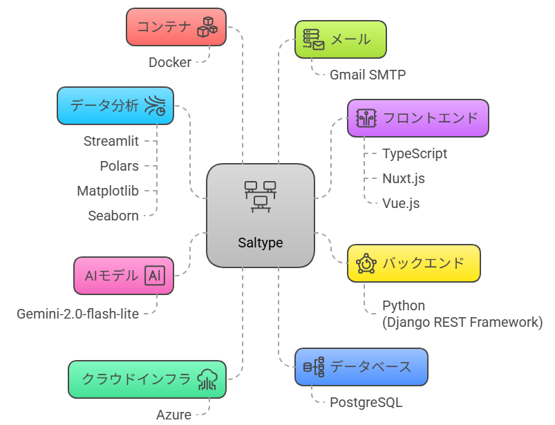
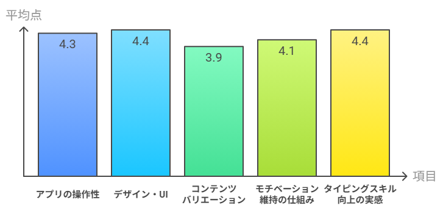

# 1年目エンジニアが社内向けアプリを開発運営した話

## ①感謝

Saltypeをプレイしてくださった新卒の皆さん、
導入・調整に尽力してくださった竜央さん、野沢さん
そして、運用費をご支援いただいた丸山さん

本当にありがとうございました！！！🙏

おかげさまで、累計プレイ回数は**2000回を突破**し、
無事最後まで運用を続けることができました。🎉🎉🎉

## ②あいさつ

こんにちは。
開発1部1課2Gの菅と、開発1部1課1Gの松村です。

私たちは今回、新卒向けタイピングアプリ「Saltype」の
**要件定義・設計・開発・テスト・運用まで、すべての工程**を担当しました。

本記事では、その中で感じた学びや苦労、工夫したポイントなどをまとめています。
ぜひ最後まで読んでいただけると嬉しいです。🙏

## ③Saltypeってどんなアプリ？ 

Saltypeは、タイピングスキル向上を目的とした**社内向けアプリ**です。

### 技術スタック

こう見ると沢山の技術を使っているように見えますね...
個人的には、データ分析にPandasでなくPolarsを使ったのがポイントです。(Rust製で高速)

### 主な機能

| 機能 | 説明 |
|------|------|
| **タイピング練習** | 英語／日本語 × イージー／ノーマル／ハードの6モード |
| **ランキング表示** | ユーザー間のスコア比較とランキング |
| **分析情報表示** | 個人のタイピングスキル推移と統計データ |
| **要望送信** | 運営への改善要望を直接送信 |
| **アプリデザインカスタマイズ** | 色のテーマやUI設定の変更 |
| **ユーザー情報設定** | ユーザー名、パスワードの変更 |
| **ランキングメール送信機能** | ランキング結果を毎日19:00に全員にメールで送信 |
| **AIタイピング機能** | 入力した単語に関連する語句で練習できる、AI連携機能 |

## ④学んだこと 📚

### ① プロジェクト管理の重要性 📋

### ② 技術的な成長 🚀

## つらかったこと 😰

### 😵‍💫 圧倒的に工数が足りない 
- **通常業務と並行**していたため、土日や早朝を使って進める場面も
- 2人での開発だったため、作業量が膨大

### 📖 知識が足りなすぎる 
- バックエンド、フロントエンド、インフラ、メール設定…**すべてが初めて**
- 技術選定から実装まで、学習しながらの開発

### 🔧 技術的な課題
| 課題 | 具体的な苦労 |
|------|-------------|
| **AI機能の実装** | 外部APIとの連携やレスポンス処理で苦労 |
| **データベース設計** | スコア管理やユーザー情報の適切な設計に時間がかかる |
| **セキュリティ** | 社内アプリとはいえ、適切なセキュリティ対策が必要 |

## フィードバックアンケート結果 📊

### 満足度調査（16名回答）

### 📈 結果の分析
- **最高評価**: デザイン・UIとタイピングスキル向上の実感
- **改善が必要**: コンテンツのバリエーション
- **全体的に良好**: 全項目で3.9以上の評価

## ユーザーからの要望と対応 💭

### 🔧 技術的な改善要望

| 要望 | 対応状況 | 対応内容 |
|------|----------|----------|
| **セッション切れ時のログイン画面遷移** | ✅ 完了 | セッション管理システムを改善 |
| **毎日のログインエラー解消** | ✅ 完了 | 認証トークンの有効期限を延長 |
| **反応の遅さ改善** | ✅ 完了 | フロントエンド・バックエンド最適化 |
| **「じゃ、じゅ、じょ」の入力改善** | ✅ 完了 | 拗音の入力パターンを拡充 |

### 🎮 機能追加要望

| 要望 | 対応状況 | 詳細 |
|------|----------|------|
| **太鼓の達人風の鬼モード** | 🔄 検討中 | ゲーミフィケーション要素として実装予定 |
| **タイプミス即終了モード** | 🔄 検討中 | ハードモードとして追加予定 |
| **長い論文のタイピング** | 🔄 検討中 | コンテンツ拡充として追加予定 |
| **プログラム言語のタイピング** | 🔄 検討中 | 技術者向けコンテンツとして追加予定 |

### 💬 実際のユーザーの声

> **「セッションが切れているときにログイン画面に戻してほしい」**
> → ✅ セッション管理システムを改善しました

> **「太鼓の達人みたく何かしたら鬼モードにチャレンジできるようにしても面白いかも」**
> → 🔄 非常に興味深いアイデアです！現在検討中です

> **「文章のバリエーションを増やしてほしいです」**
> → ✅ 新しいコンテンツを継続的に追加しています

## 今後の展望 🔮

### 技術的な改善 ⚡
- **パフォーマンス最適化**: より高速なレスポンスを実現
- **新機能の追加**: 音声認識機能やゲーミフィケーション要素の強化
- **モバイル対応**: スマートフォンやタブレットでの利用を検討

### 運用面での改善 🔄
- **自動化**: デプロイメントやテストの自動化
- **監視強化**: システムの安定性向上のための監視体制の構築
- **ドキュメント整備**: 保守性向上のための技術文書の充実

## 最後に感謝 🙇‍♂️

ここまで読んでいただき、ありがとうございました。

このプロジェクトを通じて、技術的な成長だけでなく、プロジェクト管理やユーザーとのコミュニケーションなど、多くのことを学ぶことができました。

特に、新卒の皆さんが積極的に利用してくださり、貴重なフィードバックをいただけたことが、私たちにとって大きな励みになりました。

今後も、この経験を活かして、より良いプロダクトを作っていきたいと思います。